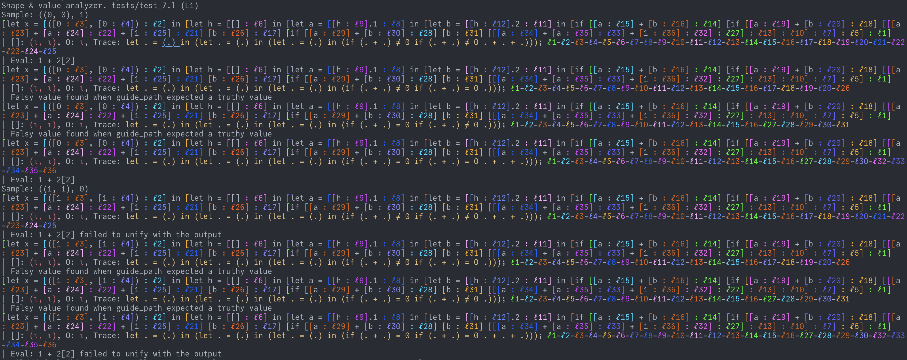

# Ln
See the [documentation](ln.pdf) for syntax and semantics.

## Usage
To run, execute
```sh
./l <test.l
```
after `make`.

## Sample code
```
# lang 1
# 1 1
let v (x, 3) case [] (y, z) if v.1 y v.2 0
```
should output
```
Type checker version: L1
[let x = [1 : ℓ2] in [let v = [([x : ℓ5], [3 : ℓ6]) : ℓ4] in [case [v : ℓ8] (y,z) [if [[v : ℓ11].1 : ℓ10] [y : ℓ12] [[v : ℓ14].2 : ℓ13] : ℓ9] [0 : ℓ15] : ℓ7] : ℓ3] : ℓ1]
| []: τ, O: ι, Trace: let . = ((., .)) in (case (.) : * if (.) ≠ 0 .); ℓ1-ℓ2-ℓ3-ℓ4-ℓ5-ℓ6-ℓ8-ℓ10-ℓ11-ℓ12
| []: τ, O: ι, Trace: let . = ((., .)) in (case (.) : * if (.) = 0 .); ℓ1-ℓ2-ℓ3-ℓ4-ℓ5-ℓ6-ℓ8-ℓ10-ℓ11-ℓ13-ℓ14
```
The output is xterm-256 colorized:

